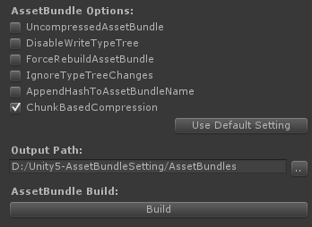

AssetBundleSetting for Unity 5.x
================================

A tool which provides a simple editor setting to build assetbundles especially on Unity5.x.

It provides various assetbundle options regardless of Unity's minor version and makes it easy to build assetbundles. 
If the version of Unity is 5.3.x, it provides *'ChunkBasedCompression'* option which is newly added on Unity 5.3.x.

Usage
-----

* Select 'Tools/AssetBundles/Create Build Setting' menu item.
* Select the created *'AssetBundleBuildSetting.asset'* setting file which is found under the *'Assets/AssetBundleManager/Editor'* directory.
* Set assetbundle options.
* Set output directory where the created bundles are placed.
* Build!

Known Issues
------------
* Highly recommended to use with Unity 5.x.
* It does not contain any script to load assetbundles, See [an asset bundle demo for Unity5 on bitbucket site](https://bitbucket.org/Unity-Technologies/assetbundledemo) or other stuff for that.
* Not support per-build target platform specific setting at the moment.

References
----------
* [Official Unity3D document page for AssetBundle5x](http://docs.unity3d.com/500/Documentation/Manual/BuildingAssetBundles5x.html)
* [Official Unity3D tutorial page for Assetbundles and the Assetbundle Manager](https://unity3d.com/kr/learn/tutorials/topics/scripting/assetbundles-and-assetbundle-manager)
* [An asset bundle demo for Unity5 on bitbucket site](https://bitbucket.org/Unity-Technologies/assetbundledemo)
* [A comprehensive document on the changes of assetbundle on Unity 5.3.x at the blog page of テラシュールブログ](http://tsubakit1.hateblo.jp/entry/2015/12/16/233336)
* [LZ4 compression related - AssetBundleのパフォーマンスを計測したかった～Unity5.3.1編～](http://veniegames.com/?p=262)
* [LZ4 compression related - Unity5.3のAssetBundleパフォーマンス計測](https://www.google.co.kr/url?sa=t&rct=j&q=&esrc=s&source=web&cd=6&cad=rja&uact=8&ved=0ahUKEwjllNOiwqbLAhVBpJQKHQN7DHUQFghJMAU&url=http%3A%2F%2Fqiita.com%2Fvui%2Fitems%2Fe25dacb22c085606e15f&usg=AFQjCNGYACO0hGvksrgCrjs_eecA6Aa5wA&sig2=-8DI6h-Rs8itXw85xmEVkQ&bvm=bv.115339255,d.dGo)
* [Improved Unity asset bundle file compression on Rich Geldreich's Tech Blog](http://richg42.blogspot.kr/2015/01/improved-unity-asset-bundle-file.html)

License
-------

This code is distributed under the terms and conditions of the MIT license.

Copyright (c) 2016 Kim, Hyoun Woo
