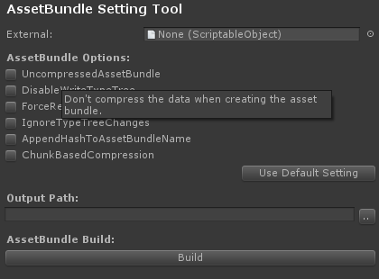

Unity5-AssetBundleSetting
=========================

A tool which provides a simple editor setting for building assetbundles especially Unity5.x version.

References
----------
* [Official Unity3D document page for AssetBundle5x](http://docs.unity3d.com/500/Documentation/Manual/BuildingAssetBundles5x.html)
* [An asset bundle demo for Unity5 on bitbucket site](https://bitbucket.org/Unity-Technologies/assetbundledemo)
* [A comprehensive document on the blog page of テラシュールブログ](http://tsubakit1.hateblo.jp/entry/2015/12/16/233336)

License
-------

This code is distributed under the terms and conditions of the MIT license.

Copyright (c) 2016 Kim, Hyoun Woo
